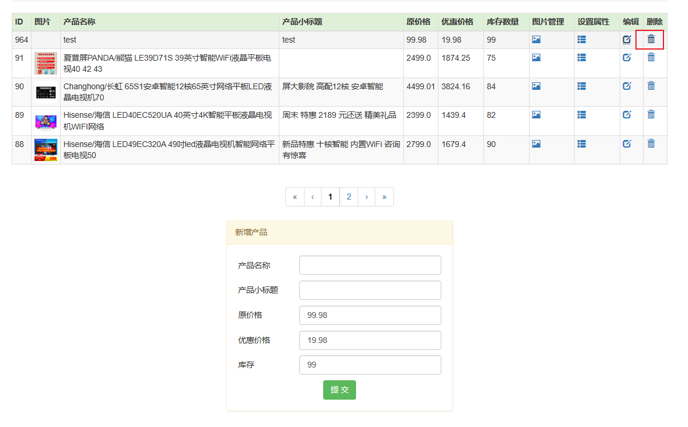

<!-- START doctoc generated TOC please keep comment here to allow auto update -->
<!-- DON'T EDIT THIS SECTION, INSTEAD RE-RUN doctoc TO UPDATE -->
**Table of Contents**  *generated with [DocToc](https://github.com/thlorenz/doctoc)*

- [tmall](#tmall)
  - [数据模型](#%E6%95%B0%E6%8D%AE%E6%A8%A1%E5%9E%8B)
  - [登录(5分)](#%E7%99%BB%E5%BD%955%E5%88%86)
  - [注册5分](#%E6%B3%A8%E5%86%8C5%E5%88%86)
    - [以用户为例](#%E4%BB%A5%E7%94%A8%E6%88%B7%E4%B8%BA%E4%BE%8B)
    - [运行效果](#%E8%BF%90%E8%A1%8C%E6%95%88%E6%9E%9C)
  - [增加功能5分](#%E5%A2%9E%E5%8A%A0%E5%8A%9F%E8%83%BD5%E5%88%86)
    - [以分类为例](#%E4%BB%A5%E5%88%86%E7%B1%BB%E4%B8%BA%E4%BE%8B)
    - [运行效果](#%E8%BF%90%E8%A1%8C%E6%95%88%E6%9E%9C-1)
  - [删除功能5分](#%E5%88%A0%E9%99%A4%E5%8A%9F%E8%83%BD5%E5%88%86)
  - [修改功能5分](#%E4%BF%AE%E6%94%B9%E5%8A%9F%E8%83%BD5%E5%88%86)
    - [以产品为例](#%E4%BB%A5%E4%BA%A7%E5%93%81%E4%B8%BA%E4%BE%8B)
    - [运行效果](#%E8%BF%90%E8%A1%8C%E6%95%88%E6%9E%9C-2)
  - [查询功能5分](#%E6%9F%A5%E8%AF%A2%E5%8A%9F%E8%83%BD5%E5%88%86)
    - [以分类为例](#%E4%BB%A5%E5%88%86%E7%B1%BB%E4%B8%BA%E4%BE%8B-1)
  - [mysql数据库5分](#mysql%E6%95%B0%E6%8D%AE%E5%BA%935%E5%88%86)
  - [MVC模式5分](#mvc%E6%A8%A1%E5%BC%8F5%E5%88%86)
  - [DBUtils使用10分](#dbutils%E4%BD%BF%E7%94%A810%E5%88%86)
    - [代码](#%E4%BB%A3%E7%A0%81)
  - [（JSTL+EL）10分](#jstlel10%E5%88%86)
    - [代码](#%E4%BB%A3%E7%A0%81-1)
  - [(filter+Lister)10分](#filterlister10%E5%88%86)
    - [以编码过滤器为例](#%E4%BB%A5%E7%BC%96%E7%A0%81%E8%BF%87%E6%BB%A4%E5%99%A8%E4%B8%BA%E4%BE%8B)
    - [web.xml文件](#webxml%E6%96%87%E4%BB%B6)
    - [以网站人数监听为例](#%E4%BB%A5%E7%BD%91%E7%AB%99%E4%BA%BA%E6%95%B0%E7%9B%91%E5%90%AC%E4%B8%BA%E4%BE%8B)
  - [上传下载10分](#%E4%B8%8A%E4%BC%A0%E4%B8%8B%E8%BD%BD10%E5%88%86)
    - [上传jsp](#%E4%B8%8A%E4%BC%A0jsp)
    - [上传功能的服务层](#%E4%B8%8A%E4%BC%A0%E5%8A%9F%E8%83%BD%E7%9A%84%E6%9C%8D%E5%8A%A1%E5%B1%82)
    - [下载jsp](#%E4%B8%8B%E8%BD%BDjsp)
    - [下载功能的服务层](#%E4%B8%8B%E8%BD%BD%E5%8A%9F%E8%83%BD%E7%9A%84%E6%9C%8D%E5%8A%A1%E5%B1%82)
    - [运行效果](#%E8%BF%90%E8%A1%8C%E6%95%88%E6%9E%9C-3)

<!-- END doctoc generated TOC please keep comment here to allow auto update -->

# tmall

## 数据模型


## 登录(5分)


## 注册5分


### 以用户为例

数据持久层:com.jdmall.dao/UserDao.java——对用户数据的增删改和验证是否存在

```java
package com.jdmall.dao;

import java.sql.Connection;
import java.sql.PreparedStatement;
import java.sql.ResultSet;
import java.sql.SQLException;
import java.sql.Statement;
import java.util.ArrayList;
import java.util.List;

import com.jdmall.bean.User;
import com.jdmall.util.DBUtil;

public class UserDAO {
	public int getTotal() {
        int total = 0;
        try (Connection c = DBUtil.getConnection(); Statement s = c.createStatement();) {
  
            String sql = "select count(*) from User";
  
            ResultSet rs = s.executeQuery(sql);
            while (rs.next()) {
                total = rs.getInt(1);
            }
        } catch (SQLException e) {
  
            e.printStackTrace();
        }
        return total;
    }
  
    public void add(User bean) {
  
        String sql = "insert into user values(null ,? ,?)";
        try (Connection c = DBUtil.getConnection(); PreparedStatement ps = c.prepareStatement(sql);) {
  
            ps.setString(1, bean.getName());
            ps.setString(2, bean.getPassword());
  
            ps.execute();
  
            ResultSet rs = ps.getGeneratedKeys();
            if (rs.next()) {
                int id = rs.getInt(1);
                bean.setId(id);
            }
        } catch (SQLException e) {
  
            e.printStackTrace();
        }
    }
  
    public void update(User bean) {
  
        String sql = "update user set name= ? , password = ? where id = ? ";
        try (Connection c = DBUtil.getConnection(); PreparedStatement ps = c.prepareStatement(sql);) {
  
            ps.setString(1, bean.getName());
            ps.setString(2, bean.getPassword());
            ps.setInt(3, bean.getId());
  
            ps.execute();
  
        } catch (SQLException e) {
  
            e.printStackTrace();
        }
  
    }
  
    public void delete(int id) {
  
        try (Connection c = DBUtil.getConnection(); Statement s = c.createStatement();) {
  
            String sql = "delete from User where id = " + id;
  
            s.execute(sql);
  
        } catch (SQLException e) {
  
            e.printStackTrace();
        }
    }
  
    public User get(int id) {
        User bean = null;
  
        try (Connection c = DBUtil.getConnection(); Statement s = c.createStatement();) {
  
            String sql = "select * from User where id = " + id;
  
            ResultSet rs = s.executeQuery(sql);
  
            if (rs.next()) {
                bean = new User();
                String name = rs.getString("name");
                bean.setName(name);
                String password = rs.getString("password");
                bean.setPassword(password);
                bean.setId(id);
            }
  
        } catch (SQLException e) {
  
            e.printStackTrace();
        }
        return bean;
    }
  
    public List<User> list() {
        return list(0, Short.MAX_VALUE);
    }
  
    public List<User> list(int start, int count) {
        List<User> beans = new ArrayList<User>();
  
        String sql = "select * from User order by id desc limit ?,? ";
  
        try (Connection c = DBUtil.getConnection(); PreparedStatement ps = c.prepareStatement(sql);) {
  
            ps.setInt(1, start);
            ps.setInt(2, count);
  
            ResultSet rs = ps.executeQuery();
  
            while (rs.next()) {
                User bean = new User();
                int id = rs.getInt(1);
 
                String name = rs.getString("name");
                bean.setName(name);
                String password = rs.getString("password");
                bean.setPassword(password);
                 
                bean.setId(id);
                beans.add(bean);
            }
        } catch (SQLException e) {
  
            e.printStackTrace();
        }
        return beans;
    }
    
    public boolean isExist(String name) {
		User user = get(name);
		return user != null;
	}
    
    public User get(String name) {
		User bean = null;
		
		String sql = "select * from User where name = ?";
		try (Connection c = DBUtil.getConnection(); PreparedStatement ps = c.prepareStatement(sql)) {
			ps.setString(1, name);
			ResultSet rs = ps.executeQuery();
			
			if (rs.next()) {
				bean = new User();
				int id = rs.getInt("id");
				bean.setName(name);
				String password = rs.getString("password");
				bean.setPassword(password);
				bean.setId(id);
			}		
			
		} catch (SQLException e) {
			// TODO: handle exception
			e.printStackTrace();
		}
		
		return bean;
	}
    
    public User get(String name, String password) {
        User bean = null;
          
        String sql = "select * from User where name = ? and password=?";
        try (Connection c = DBUtil.getConnection(); PreparedStatement ps = c.prepareStatement(sql)) {
            ps.setString(1, name);
            ps.setString(2, password);
            ResultSet rs =ps.executeQuery();
  
            if (rs.next()) {
                bean = new User();
                int id = rs.getInt("id");
                bean.setName(name);
                bean.setPassword(password);
                bean.setId(id);
            }
  
        } catch (SQLException e) {
  
            e.printStackTrace();
        }
        return bean;
    }

}

```

用户的服务层:com.jdmall.servlet/ForeServlet.java

```java
public class ForeServlet extends BaseBackServlet{
	
	protected CategoryDAO categoryDAO = new CategoryDAO();
    protected OrderDAO orderDAO = new OrderDAO();
    protected OrderItemDAO orderItemDAO = new OrderItemDAO();
    protected ProductDAO productDAO = new ProductDAO();
    protected ProductImageDAO productImageDAO = new ProductImageDAO();
    protected PropertyDAO propertyDAO = new PropertyDAO();
    protected PropertyValueDAO propertyValueDAO = new PropertyValueDAO();
    protected ReviewDAO reviewDAO = new ReviewDAO();
    protected UserDAO userDAO = new UserDAO();
    
    public String home(HttpServletRequest request, HttpServletResponse response, Page page) {
        List<Category> cs= categoryDAO.list();
        new ProductDAO().fill(cs);
        new ProductDAO().fillByRow(cs);
        
        request.setAttribute("cs", cs);
        
        return "fore/homePage.jsp";
    }
    
    //无需登陆的功能
    
    //注册
    public String register(HttpServletRequest request, HttpServletResponse response, Page page) {
    	String name = request.getParameter("name");
        String password = request.getParameter("password");
        name = HtmlUtils.htmlEscape(name);
        boolean exist = userDAO.isExist(name);
         
        if(exist){
            request.setAttribute("msg", "用户名已经被使用,不能使用");
            return "fore/registerPage.jsp"; 
        }
         
        User user = new User();
        user.setName(name);
        user.setPassword(password);
        userDAO.add(user);
         
        return "@fore/registerSuccessPage.jsp"; 
    }
    
    //登陆
    public String login(HttpServletRequest request, HttpServletResponse response, Page page) {
    	String name = request.getParameter("name");
    	String password = request.getParameter("password");
        name = HtmlUtils.htmlEscape(name);
        
        User user = userDAO.get(name, password);
        
        if(null == user){
        	request.setAttribute("msg", "账号密码错误");
            return "fore/loginPage.jsp";
        }
        
        request.getSession().setAttribute("user", user);
        return "@forehome";	//这里不能用服务端跳转 服务端跳转的话 只能直接跳转到某个页面，因为不会再进行一边过滤和BaseForeServlet了
    }
    
    //退出
    public String logout(HttpServletRequest request, HttpServletResponse response, Page page) {
    	request.getSession().removeAttribute("user");
        return "@forehome";
    }
    
    //产品页
    public String product(HttpServletRequest request, HttpServletResponse response, Page page) {
    	int pid = Integer.parseInt(request.getParameter("pid"));
    	
    	//产品实体 包括展示图片和基本信息
    	Product p = productDAO.get(pid);
    	productDAO.setFirstProductImage(p);
    	productDAO.setSaleAndReviewNumber(p);
    	List<ProductImage> productSingleImages = productImageDAO.list(p, ProductImageDAO.type_single);
    	List<ProductImage> productDetailImages = productImageDAO.list(p, ProductImageDAO.type_detail);
    	p.setProductSingleImages(productSingleImages);
    	p.setProductDetailImages(productDetailImages);
    	
    	//产品属性实体
    	List<PropertyValue> pvs = propertyValueDAO.list(p.getId());
    	
    	//产品评价实体
    	List<Review> reviews = reviewDAO.list(p.getId());
        
    	request.setAttribute("p", p);
    	request.setAttribute("pvs", pvs);
    	request.setAttribute("reviews", reviews);
    	
    	return "fore/productPage.jsp?pid=" + pid;
    }
    
    //分类页
    public String category(HttpServletRequest request, HttpServletResponse response, Page page) {
    	int cid = Integer.parseInt(request.getParameter("cid"));
    	
    	Category c = new CategoryDAO().get(cid);
        new ProductDAO().fill(c);
        new ProductDAO().setSaleAndReviewNumber(c.getProducts());      
         
        String sort = request.getParameter("sort");
        if(null!=sort){
            switch(sort){
                case "review":
                    Collections.sort(c.getProducts(),new ProductReviewComparator());
                    break;
                case "date" :
                    Collections.sort(c.getProducts(),new ProductDateComparator());
                    break;
                     
                case "saleCount" :
                    Collections.sort(c.getProducts(),new ProductSaleCountComparator());
                    break;
                     
                case "price":
                    Collections.sort(c.getProducts(),new ProductPriceComparator());
                    break;
                     
                case "all":
                    Collections.sort(c.getProducts(),new ProductAllComparator());
                    break;
            }
        }
        
        request.setAttribute("c", c);
    	
    	return "fore/categoryPage.jsp";
    }
    
    //分类页
    public String search(HttpServletRequest request, HttpServletResponse response, Page page) {
    	String keyword = request.getParameter("keyword");
    	
        List<Product> ps= new ProductDAO().search(keyword,0,20);
        productDAO.setSaleAndReviewNumber(ps);
        
        request.setAttribute("ps",ps);
    	
    	return "fore/searchResultPage.jsp";
    }
    
    //检查是否登陆
    public String checkLogin(HttpServletRequest request, HttpServletResponse response, Page page) {
        User user =(User) request.getSession().getAttribute("user");
        if(null!=user)
            return "%success";
        return "%fail";
    }
    
    //模态登陆
    public String loginAjax(HttpServletRequest request, HttpServletResponse response, Page page) {
    	String name = request.getParameter("name");
        String password = request.getParameter("password");    
        User user = userDAO.get(name,password);
         
        if(null==user){
            return "%fail";
        }
        request.getSession().setAttribute("user", user);
        return "%success"; 
    }
    
    //立即购买 第一步 直接操作数据库中的 订单项 这时的订单项都是订单id=-1 这是订单项还没有生成订单的标志
    public String buyone(HttpServletRequest request, HttpServletResponse response, Page page) {
    	int pid = Integer.parseInt(request.getParameter("pid"));
        int num = Integer.parseInt(request.getParameter("num"));
        User user =(User) request.getSession().getAttribute("user");
        
        Product p = productDAO.get(pid);
        int oiid = 0;
        boolean found = false;
        //考虑到如果没有立即付款 那么依然需要到购物车中找到它  因此需要放在购物车中
        List<OrderItem> ois = orderItemDAO.listByUser(user.getId());
        for (OrderItem oi : ois) {
            if(oi.getProduct().getId()==p.getId()){
                oi.setNumber(oi.getNumber()+num);
                orderItemDAO.update(oi);
                found = true;
                oiid = oi.getId();
                break;
            }
        }      
        if(!found){
            OrderItem oi = new OrderItem();
            oi.setUser(user);
            oi.setNumber(num);
            oi.setProduct(p);
            oi.setOrder(null);
            orderItemDAO.add(oi);
            oiid = oi.getId();
        }
        	
    	return "@forebuy?oiid=" + oiid;
    }
    
    //根据订单项列表 显示结算页面
    public String buy(HttpServletRequest request, HttpServletResponse response, Page page) {
    	String[] oiids=request.getParameterValues("oiid");
    	User user =(User) request.getSession().getAttribute("user");
    	
    	List<OrderItem> ois = new ArrayList<>();
        float total = 0;
     
        for (String strid : oiids) {
            int oiid = Integer.parseInt(strid);
            OrderItem oi= orderItemDAO.get(oiid);
            if(user.getId() != oi.getUser().getId()){
            	response.setContentType("text/html; charset=UTF-8");
            	return "%您试图访问他人的订单 请停止这种行为";
            }
            productDAO.setFirstProductImage(oi.getProduct());
            total +=oi.getProduct().getPromotePrice()*oi.getNumber();
            ois.add(oi);
        }
         
        request.getSession().setAttribute("ois", ois);
        request.setAttribute("total", total);
        
        return "fore/settleAccountPage.jsp";
    }
    
    
    //加入购物车
    public String addCart(HttpServletRequest request, HttpServletResponse response, Page page) {
        int pid = Integer.parseInt(request.getParameter("pid"));
        int num = Integer.parseInt(request.getParameter("num"));
        User user =(User) request.getSession().getAttribute("user");

        Product p = productDAO.get(pid);
        boolean found = false;
        List<OrderItem> ois = orderItemDAO.listByUser(user.getId());
        for (OrderItem oi : ois) {
            if(oi.getProduct().getId()==p.getId()){
                oi.setNumber(oi.getNumber()+num);
                orderItemDAO.update(oi);
                found = true;
                break;
            }
        }      
        if(!found){
            OrderItem oi = new OrderItem();
            oi.setUser(user);
            oi.setNumber(num);
            oi.setProduct(p);
            orderItemDAO.add(oi);
        }
        return "%success";
    }
    
    //我的订单
    public String cart(HttpServletRequest request, HttpServletResponse response, Page page) {
        User user =(User) request.getSession().getAttribute("user");
        
        List<OrderItem> ois = orderItemDAO.listByUser(user.getId());
        for (OrderItem oi : ois) {
			productDAO.setFirstProductImage(oi.getProduct());
		}
        
        request.setAttribute("ois", ois);
        
        return "fore/shoppingcartPage.jsp";
    }
    
    //在购物修改订单项
    public String changeOrderItem(HttpServletRequest request, HttpServletResponse response, Page page) {
    	User user =(User) request.getSession().getAttribute("user");
    	if(null==user)
			return "%fail";
    	
    	int pid = Integer.parseInt(request.getParameter("pid"));
    	int number = Integer.parseInt(request.getParameter("number"));
    	
    	List<OrderItem> ois = orderItemDAO.listByUser(user.getId());
    	for (OrderItem oi : ois) {
			if(oi.getProduct().getId()==pid){
				oi.setNumber(number);
				orderItemDAO.update(oi);
				break;
			}
			
		}
    	
    	return "%success";
    }
    
    //在购物车删除订单项
    public String deleteOrderItem(HttpServletRequest request, HttpServletResponse response, Page page){
		User user =(User) request.getSession().getAttribute("user");
		if(null==user)
			return "%fail";
		
		int oiid = Integer.parseInt(request.getParameter("oiid"));
		orderItemDAO.delete(oiid);
		
		return "%success";
	}
    
    //生成订单
    public String createOrder(HttpServletRequest request, HttpServletResponse response, Page page){
        User user =(User) request.getSession().getAttribute("user");
        List<OrderItem> ois= (List<OrderItem>) request.getSession().getAttribute("ois");
        if(ois.isEmpty())
            return "@/fore/loginPage.jsp";
     
        String address = request.getParameter("address");
        String post = request.getParameter("post");
        String receiver = request.getParameter("receiver");
        String mobile = request.getParameter("mobile");
        String userMessage = request.getParameter("userMessage");
        
        Order order = new Order();
        String orderCode = new SimpleDateFormat("yyyyMMddHHmmssSSS").format(new Date()) +RandomUtils.nextInt(10000);
     
        order.setOrderCode(orderCode);
        order.setAddress(address);
        order.setPost(post);
        order.setReceiver(receiver);
        order.setMobile(mobile);
        order.setUserMessage(userMessage);
        order.setCreateDate(new Date());
        order.setUser(user);
        order.setStatus(OrderDAO.waitPay);
     
        orderDAO.add(order);
        
        float total =0;
        for (OrderItem oi: ois) {
            oi.setOrder(order);
            orderItemDAO.update(oi);
            total+=oi.getProduct().getPromotePrice()*oi.getNumber();
        }
         
        return "@forepay?oid="+order.getId() +"&total="+total;
    }
    
    public String pay(HttpServletRequest request, HttpServletResponse response, Page page){
        return "fore/payPage.jsp";
    }
    
    //支付成功
    public String paysuccess(HttpServletRequest request, HttpServletResponse response, Page page) {
        int oid = Integer.parseInt(request.getParameter("oid"));
        
        Order order = orderDAO.get(oid);
        order.setStatus(OrderDAO.waitDelivery);
        order.setPayDate(new Date());
        new OrderDAO().update(order);
        
        request.setAttribute("o", order);
        
        return "fore/paySuccessPage.jsp";    
    } 
    
    //我的订单
    public String myorder(HttpServletRequest request, HttpServletResponse response, Page page) {
    	User user =(User) request.getSession().getAttribute("user");
    	
        List<Order> os= orderDAO.list(user.getId(),OrderDAO.delete);
        orderItemDAO.fill(os);
        
        for (Order o : os) {
        	for (OrderItem oi : o.getOrderItems()) {
				productDAO.setFirstProductImage(oi.getProduct());
			}
		}
        
        request.setAttribute("os", os);
        
    	return "fore/myorderPage.jsp";
    }
    
    //订单页的确认收货按钮 跳转去确认信息
    public String confirmPay(HttpServletRequest request, HttpServletResponse response, Page page) {
        int oid = Integer.parseInt(request.getParameter("oid"));
        
        Order o = orderDAO.get(oid);
        orderItemDAO.fill(o);
        
        for (OrderItem oi : o.getOrderItems()) {
			productDAO.setFirstProductImage(oi.getProduct());
		}
        
        request.setAttribute("o", o);
        
        return "fore/confirmPage.jsp";       
    }
    
    //确认收货
    public String orderfinished(HttpServletRequest request, HttpServletResponse response, Page page) {
        int oid = Integer.parseInt(request.getParameter("oid"));
        
        Order o = orderDAO.get(oid);
        o.setStatus(OrderDAO.waitReview);
        o.setConfirmDate(new Date());
        orderDAO.update(o);
        
        return "fore/orderFinishedPage.jsp";
    }
    
    //跳转到评价订单
	public String review(HttpServletRequest request, HttpServletResponse response, Page page) {
		int oid = Integer.parseInt(request.getParameter("oid"));
		
		Order o = orderDAO.get(oid);
	    orderItemDAO.fill(o);
	    Product p = o.getOrderItems().get(0).getProduct();
	    productDAO.setFirstProductImage(p);
	    List<Review> reviews = reviewDAO.list(p.getId());
	    productDAO.setSaleAndReviewNumber(p);
	    
	    request.setAttribute("p", p);
	    request.setAttribute("o", o);
	    request.setAttribute("reviews", reviews);
		
		return "fore/reviewPage.jsp";
	}
	
	//提交评价
	public String doreview(HttpServletRequest request, HttpServletResponse response, Page page) {
		User user =(User) request.getSession().getAttribute("user");
		int oid = Integer.parseInt(request.getParameter("oid"));
		int pid = Integer.parseInt(request.getParameter("pid"));

		Order o = orderDAO.get(oid);
	    o.setStatus(OrderDAO.finish);
	    orderDAO.update(o);
	    
	    Product p = productDAO.get(pid);
	    String content = request.getParameter("content");
	    content = HtmlUtils.htmlEscape(content);
	    Review review = new Review();
	    review.setContent(content);
	    review.setProduct(p);
	    review.setCreateDate(new Date());
	    review.setUser(user);
	    reviewDAO.add(review);
	     
	    return "@forereview?oid="+oid+"&showonly=true";   
	}
	
	//删除订单
	public String deleteOrder(HttpServletRequest request, HttpServletResponse response, Page page){
	    int oid = Integer.parseInt(request.getParameter("oid"));
	    
	    Order o = orderDAO.get(oid);
	    o.setStatus(OrderDAO.delete);
	    orderDAO.update(o);
	    
	    return "%success";     
	}
```

### 运行效果


## 增加功能5分

### 以分类为例

数据持久层：com.jdmall.dao.CategoryDAO.java

```java
package com.jdmall.dao;

import java.sql.Connection;
import java.sql.PreparedStatement;
import java.sql.ResultSet;
import java.sql.SQLException;
import java.sql.Statement;
import java.util.ArrayList;
import java.util.List;

import com.jdmall.bean.Category;
import com.jdmall.util.DBUtil;

public class CategoryDAO {
	public int getTotal() {
		int total = 0;
		/*连接到数据库（Connection）、建立操作指令（Statement）、执行查询指令（executeQuery）、获得查询结果（ResultSet）等。
		
		声名类（statement）（依次继承而来）
		（1）Statement对象用于执行不带参数的简单的SQL语句；Statement接口提供了执行语句和获取结果的基本方法。

		（2）PerparedStatement对象用于执行带或不带IN参数的预编译SQL语句；PeraredStatement接口添加处理IN参数的方法；

		（3）CallableStatement对象用于执行对数据库已存储过程的调用；CallableStatement添加处理OUT参数的方法
		
		Statement提供了许多方法，最常用的方法如下：
		（1）execute()方法：运行语句，返回是否有结果集。

		（2）executeQuery()方法：运行查询语句，返回ReaultSet对象。

		（3）executeUpdata()方法：运行更新操作，返回更新的行数。

		（4）addBatch()方法：增加批处理语句。

		（5）executeBatch()方法：执行批处理语句。

		（6）clearBatch()方法：清除批处理语句。*/
		try (Connection c = DBUtil.getConnection(); Statement s = c.createStatement();) {

			String sql = "select count(*) from Category";

			ResultSet rs = s.executeQuery(sql);//rs：数据集
			while (rs.next()) {                //获取下一列
				total = rs.getInt(1);          //通过索引和列名来获取某一列的值
			}
		} catch (Exception e) {
			// TODO: handle exception
			e.printStackTrace();
		}
		return total;
	}

	public void add(Category bean) {

		String sql = "insert into category values(null,?)";
		try (Connection c = DBUtil.getConnection(); PreparedStatement ps = c.prepareStatement(sql);) {

			ps.setString(1, bean.getName());         //第一个参数具体指哪个“？”，第二个参数替换的值
			ps.execute();
			ResultSet re = ps.getGeneratedKeys();    //获取主键

			if (re.next()) {
				int id = re.getInt(1);
				bean.setId(id);
			}

		} catch (SQLException e) {
			// TODO: handle exception
			e.printStackTrace();
		}
	}

	public void update(Category bean) {

		String sql = "update category set name= ? where id = ?";
		try (Connection c = DBUtil.getConnection(); PreparedStatement ps = c.prepareStatement(sql);) {

			ps.setString(1, bean.getName());
			ps.setInt(2, bean.getId());                           //设置第几个参数

			ps.execute();

		} catch (SQLException e) {
			// TODO: handle exception
			e.printStackTrace();
		}

	}

	public void delete(int id) {
		try (Connection c = DBUtil.getConnection(); Statement s = c.createStatement();) {

			String sql = "delete form Category where id = " + id;
			s.execute(sql);

		} catch (SQLException e) {
			// TODO: handle exception
			e.printStackTrace();
		}

	}

	public Category get(int id) {
		Category bean = null;
		try (Connection c = DBUtil.getConnection(); Statement s = c.createStatement();) {
			String sql = "select * from category where id = " + id;

			ResultSet rs = s.executeQuery(sql);

			if (rs.next()) {
				bean = new Category();
				String name = rs.getString(2);//获取第二列的数据
				bean.setName(name);
				bean.setId(id);
			}

		} catch (SQLException e) {
			// TODO: handle exception
			e.printStackTrace();
		}
		return bean;

	}

	public List<Category> list() {
		return list(0, Short.MAX_VALUE);
	}

	public List<Category> list(int start, int count) {
		// TODO Auto-generated method stub
		List<Category> beans = new ArrayList<Category>();

		String sql = "select * from category order by id desc limit ?,?";

		try (Connection c = DBUtil.getConnection(); PreparedStatement ps = c.prepareStatement(sql);) {

			ps.setInt(1, start);
			ps.setInt(2, count);

			ResultSet rs = ps.executeQuery();

			while (rs.next()) {
				Category bean = new Category();
				int id = rs.getInt(1);
				String name = rs.getString(2);
				bean.setId(id);
				bean.setName(name);
				beans.add(bean);
			}
		} catch (SQLException e) {
			// TODO: handle exception
			e.printStackTrace();
		}

		return beans;
	}
}

```

分类功能服务层：com.jdmall.servlet.CategoryServlet.java

```java
package com.jdmall.servlet;
 
import java.awt.image.BufferedImage;   
import java.io.File;
import java.io.FileOutputStream;
import java.io.IOException;
import java.io.InputStream;
import java.util.HashMap;
import java.util.List;
import java.util.Map;
 
import javax.imageio.ImageIO;
import javax.servlet.http.HttpServletRequest;
import javax.servlet.http.HttpServletResponse;
 
import com.jdmall.bean.Category;
import com.jdmall.util.ImageUtil;
import com.jdmall.util.Page;
 
public class CategoryServlet extends BaseBackServlet {
     
    @Override
    public String add(HttpServletRequest request, HttpServletResponse response, Page page) {
        Map<String,String> params = new HashMap<>();
        InputStream is = super.parseUpload(request, params);//获取上传文件的输入流

        String name = params.get("name");
        Category c = new Category();
        c.setName(name);
        categoryDAO.add(c);

        File  imageFolder= new File(request.getSession().getServletContext().getRealPath("img/category"));
        File file = new File(imageFolder,c.getId()+".jpg");

        try {
            if(null!=is && 0!=is.available()){
                try(FileOutputStream fos = new FileOutputStream(file)){
                    byte b[] = new byte[1024 * 1024];
                    int length = 0;
                    while (-1 != (length = is.read(b))) {
                        fos.write(b, 0, length);
                    }
                    fos.flush();
                    //通过如下代码，把文件保存为jpg格式
                    BufferedImage img = ImageUtil.change2jpg(file);
                    ImageIO.write(img, "jpg", file);
                }
                catch(Exception e){
                    e.printStackTrace();
                }
            }
        } catch (IOException e) {
            // TODO Auto-generated catch block
            e.printStackTrace();
        }
        return "@admin_category_list";
    }

    @Override
    public String delete(HttpServletRequest request, HttpServletResponse response, Page page) {
        int id = Integer.parseInt(request.getParameter("id"));
        categoryDAO.delete(id);
        return "@admin_category_list";
    }

    @Override
    public String edit(HttpServletRequest request, HttpServletResponse response, Page page) {
        int id = Integer.parseInt(request.getParameter("id"));
        Category c = categoryDAO.get(id);
        request.setAttribute("c", c);
        return "admin/editCategory.jsp";
    }

    @Override
    public String update(HttpServletRequest request, HttpServletResponse response, Page page) {
        Map<String,String> params = new HashMap<>();
        InputStream is = super.parseUpload(request, params);

        System.out.println(params);
        String name= params.get("name");
        int id = Integer.parseInt(params.get("id"));

        Category c = new Category();
        c.setId(id);
        c.setName(name);
        categoryDAO.update(c);

        File  imageFolder= new File(request.getSession().getServletContext().getRealPath("img/category"));
        File file = new File(imageFolder,c.getId()+".jpg");
        file.getParentFile().mkdirs();

        try {
            if(null!=is && 0!=is.available()){
                try(FileOutputStream fos = new FileOutputStream(file)){
                    byte b[] = new byte[1024 * 1024];
                    int length = 0;
                    while (-1 != (length = is.read(b))) {
                        fos.write(b, 0, length);
                    }
                    fos.flush();
                    //通过如下代码，把文件保存为jpg格式
                    BufferedImage img = ImageUtil.change2jpg(file);
                    ImageIO.write(img, "jpg", file);
                }
                catch(Exception e){
                    e.printStackTrace();
                }
            }
        } catch (IOException e) {
            // TODO Auto-generated catch block
            e.printStackTrace();
        }
        return "@admin_category_list";

    }

    @Override
    public String list(HttpServletRequest request, HttpServletResponse response, Page page) {
        List<Category> cs = categoryDAO.list(page.getStart(),page.getCount());
        int total = categoryDAO.getTotal();
        page.setTotal(total);

        request.setAttribute("thecs", cs);
        request.setAttribute("page", page);

        return "admin/listCategory.jsp";
    }
}
```

### 运行效果


## 删除功能5分

## 修改功能5分

### 以产品为例

产品的数据持久层：com.jdmall.dao.ProductDAO.java

```java
package com.jdmall.dao;

import java.sql.Connection;
import java.sql.PreparedStatement;
import java.sql.ResultSet;
import java.sql.SQLException;
import java.sql.Statement;
import java.util.ArrayList;
import java.util.Date;
import java.util.List;
 
import com.jdmall.bean.Category;
import com.jdmall.bean.Product;
import com.jdmall.bean.ProductImage;
import com.jdmall.util.DBUtil;
import com.jdmall.util.DateUtil;

public class ProductDAO {
	
	public int getTotal(int cid) {
        int total = 0;
        try (Connection c = DBUtil.getConnection(); Statement s = c.createStatement();) {
  
            String sql = "select count(*) from Product where cid = " + cid;
  
            ResultSet rs = s.executeQuery(sql);
            while (rs.next()) {
                total = rs.getInt(1);
            }
        } catch (SQLException e) {
  
            e.printStackTrace();
        }
        return total;
    }
  
    public void add(Product bean) {
 
        String sql = "insert into Product values(null,?,?,?,?,?,?,?)";
        try (Connection c = DBUtil.getConnection(); PreparedStatement ps = c.prepareStatement(sql);) {
  
            ps.setString(1, bean.getName());
            ps.setString(2, bean.getSubTitle());
            ps.setFloat(3, bean.getOrignalPrice());
            ps.setFloat(4, bean.getPromotePrice());
            ps.setInt(5, bean.getStock());
            ps.setInt(6, bean.getCategory().getId());
            ps.setTimestamp(7, DateUtil.d2t(bean.getCreateDate()));
            ps.execute();
  
            ResultSet rs = ps.getGeneratedKeys();
            if (rs.next()) {
                int id = rs.getInt(1);
                bean.setId(id);
            }
        } catch (SQLException e) {
  
            e.printStackTrace();
        }
    }
  
    public void update(Product bean) {
 
        String sql = "update Product set name= ?, subTitle=?, orignalPrice=?,promotePrice=?,stock=?, cid = ?, createDate=? where id = ?";
        try (Connection c = DBUtil.getConnection(); PreparedStatement ps = c.prepareStatement(sql);) {
 
            ps.setString(1, bean.getName());
            ps.setString(2, bean.getSubTitle());
            ps.setFloat(3, bean.getOrignalPrice());
            ps.setFloat(4, bean.getPromotePrice());
            ps.setInt(5, bean.getStock());
            ps.setInt(6, bean.getCategory().getId());
            ps.setTimestamp(7, DateUtil.d2t(bean.getCreateDate()));
            ps.setInt(8, bean.getId());
            ps.execute();
  
        } catch (SQLException e) {
  
            e.printStackTrace();
        }
  
    }
  
    public void delete(int id) {
  
        try (Connection c = DBUtil.getConnection(); Statement s = c.createStatement();) {
  
            String sql = "delete from Product where id = " + id;
  
            s.execute(sql);
  
        } catch (SQLException e) {
  
            e.printStackTrace();
        }
    }
  
    public Product get(int id) {
        Product bean = new Product();
  
        try (Connection c = DBUtil.getConnection(); Statement s = c.createStatement();) {
  
            String sql = "select * from Product where id = " + id;
  
            ResultSet rs = s.executeQuery(sql);
  
            if (rs.next()) {
 
                String name = rs.getString("name");
                String subTitle = rs.getString("subTitle");
                float orignalPrice = rs.getFloat("orignalPrice");
                float promotePrice = rs.getFloat("promotePrice");
                int stock = rs.getInt("stock");
                int cid = rs.getInt("cid");
                Date createDate = DateUtil.t2d( rs.getTimestamp("createDate"));
               
                bean.setName(name);
                bean.setSubTitle(subTitle);
                bean.setOrignalPrice(orignalPrice);
                bean.setPromotePrice(promotePrice);
                bean.setStock(stock);
                Category category = new CategoryDAO().get(cid);
                bean.setCategory(category);
                bean.setCreateDate(createDate);
                bean.setId(id);
                setFirstProductImage(bean);
            }
  
        } catch (SQLException e) {
  
            e.printStackTrace();
        }
        return bean;
    }
  
    public List<Product> list(int cid) {
        return list(cid,0, Short.MAX_VALUE);
    }
  
    public List<Product> list(int cid, int start, int count) {
        List<Product> beans = new ArrayList<Product>();
        Category category = new CategoryDAO().get(cid);
        String sql = "select * from Product where cid = ? order by id desc limit ?,? ";
  
        try (Connection c = DBUtil.getConnection(); PreparedStatement ps = c.prepareStatement(sql);) {
            ps.setInt(1, cid);
            ps.setInt(2, start);
            ps.setInt(3, count);
  
            ResultSet rs = ps.executeQuery();
  
            while (rs.next()) {
                Product bean = new Product();
                int id = rs.getInt(1);
                String name = rs.getString("name");
                String subTitle = rs.getString("subTitle");
                float orignalPrice = rs.getFloat("orignalPrice");
                float promotePrice = rs.getFloat("promotePrice");
                int stock = rs.getInt("stock");
                Date createDate = DateUtil.t2d( rs.getTimestamp("createDate"));
 
                bean.setName(name);
                bean.setSubTitle(subTitle);
                bean.setOrignalPrice(orignalPrice);
                bean.setPromotePrice(promotePrice);
                bean.setStock(stock);
                bean.setCreateDate(createDate);
                bean.setId(id);
                bean.setCategory(category);
                setFirstProductImage(bean);
                beans.add(bean);
            }
        } catch (SQLException e) {
  
            e.printStackTrace();
        }
        return beans;
    }
    public List<Product> list() {
        return list(0,Short.MAX_VALUE);
    }
    public List<Product> list(int start, int count) {
        List<Product> beans = new ArrayList<Product>();
 
        String sql = "select * from Product limit ?,? ";
  
        try (Connection c = DBUtil.getConnection(); PreparedStatement ps = c.prepareStatement(sql);) {
 
            ps.setInt(1, start);
            ps.setInt(2, count);
  
            ResultSet rs = ps.executeQuery();
  
            while (rs.next()) {
                Product bean = new Product();
                int id = rs.getInt(1);
                int cid = rs.getInt("cid");
                String name = rs.getString("name");
                String subTitle = rs.getString("subTitle");
                float orignalPrice = rs.getFloat("orignalPrice");
                float promotePrice = rs.getFloat("promotePrice");
                int stock = rs.getInt("stock");
                Date createDate = DateUtil.t2d( rs.getTimestamp("createDate"));
 
                bean.setName(name);
                bean.setSubTitle(subTitle);
                bean.setOrignalPrice(orignalPrice);
                bean.setPromotePrice(promotePrice);
                bean.setStock(stock);
                bean.setCreateDate(createDate);
                bean.setId(id);
 
                Category category = new CategoryDAO().get(cid);
                bean.setCategory(category);
                beans.add(bean);
            }
        } catch (SQLException e) {
  
            e.printStackTrace();
        }
        return beans;
    }   
 
    public void fill(List<Category> cs) {
        for (Category c : cs) {
            fill(c);
        }
    }
    public void fill(Category c) {
            List<Product> ps = this.list(c.getId());
            c.setProducts(ps);
    }
 
    public void fillByRow(List<Category> cs) {
        int productNumberEachRow = 8;
        for (Category c : cs) {
            List<Product> products =  c.getProducts();
            List<List<Product>> productsByRow =  new ArrayList<>();
            for (int i = 0; i < products.size(); i+=productNumberEachRow) {
                int size = i+productNumberEachRow;
                size= size>products.size()?products.size():size;
                List<Product> productsOfEachRow =products.subList(i, size);
                productsByRow.add(productsOfEachRow);
            }
            c.setProductsByRow(productsByRow);
        }
    }
     
    public void setFirstProductImage(Product p) {
        List<ProductImage> pis= new ProductImageDAO().list(p, ProductImageDAO.type_single);
        if(!pis.isEmpty())
            p.setFirstProductImage(pis.get(0));    
    }
     
    public void setSaleAndReviewNumber(Product p) {
        int saleCount = new OrderItemDAO().getSaleCount(p.getId());
        p.setSaleCount(saleCount);         
 
        int reviewCount = new ReviewDAO().getCount(p.getId());
        p.setReviewCount(reviewCount);
         
    }
 
    public void setSaleAndReviewNumber(List<Product> products) {
        for (Product p : products) {
            setSaleAndReviewNumber(p);
        }
    }
 
    public List<Product> search(String keyword, int start, int count) {
         List<Product> beans = new ArrayList<Product>();
          
         if(null==keyword||0==keyword.trim().length())
             return beans;
            String sql = "select * from Product where name like ? limit ?,? ";
      
            try (Connection c = DBUtil.getConnection(); PreparedStatement ps = c.prepareStatement(sql);) {
                ps.setString(1, "%"+keyword.trim()+"%");
                ps.setInt(2, start);
                ps.setInt(3, count);
      
                ResultSet rs = ps.executeQuery();
      
                while (rs.next()) {
                    Product bean = new Product();
                    int id = rs.getInt(1);
                    int cid = rs.getInt("cid");
                    String name = rs.getString("name");
                    String subTitle = rs.getString("subTitle");
                    float orignalPrice = rs.getFloat("orignalPrice");
                    float promotePrice = rs.getFloat("promotePrice");
                    int stock = rs.getInt("stock");
                    Date createDate = DateUtil.t2d( rs.getTimestamp("createDate"));
 
                    bean.setName(name);
                    bean.setSubTitle(subTitle);
                    bean.setOrignalPrice(orignalPrice);
                    bean.setPromotePrice(promotePrice);
                    bean.setStock(stock);
                    bean.setCreateDate(createDate);
                    bean.setId(id);
 
                    Category category = new CategoryDAO().get(cid);
                    bean.setCategory(category);
                    setFirstProductImage(bean);               
                    beans.add(bean);
                }
            } catch (SQLException e) {
      
                e.printStackTrace();
            }
            return beans;
    }

}

```

产品的服务层：com.jdmall.servlet.ProductServlet.java

```jsp
package com.jdmall.servlet;

import java.util.List;

import javax.servlet.http.HttpServletRequest;
import javax.servlet.http.HttpServletResponse;

import com.jdmall.bean.Category;
import com.jdmall.bean.Product;
import com.jdmall.bean.Property;
import com.jdmall.bean.PropertyValue;
import com.jdmall.dao.CategoryDAO;
import com.jdmall.dao.ProductDAO;
import com.jdmall.dao.PropertyValueDAO;
import com.jdmall.util.Page;

public class ProductServlet extends BaseBackServlet {
	
	@Override
	public String add(HttpServletRequest request, HttpServletResponse response, Page page) {
		int cid = Integer.parseInt(request.getParameter("cid"));
		Category c = categoryDAO.get(cid);
		
		String name = request.getParameter("name");
		String subTitle = request.getParameter("subTitle");
		float orignalPrice = Float.parseFloat(request.getParameter("orignalPrice"));
		float promotePrice = Float.parseFloat(request.getParameter("promotePrice"));
		int stock = Integer.parseInt(request.getParameter("stock"));
		
		Product p = new Product();
		
		p.setCategory(c);
		p.setName(name);
		p.setSubTitle(subTitle);
		p.setOrignalPrice(orignalPrice);
		p.setPromotePrice(promotePrice);
		p.setStock(stock);
		
		productDAO.add(p);
		return "@admin_product_list?cid=" + cid;	
	}
	
	@Override
	public String delete(HttpServletRequest request, HttpServletResponse response, Page page) {
		
		int id = Integer.parseInt(request.getParameter("id"));
		Product p = productDAO.get(id);
		productDAO.delete(id);
		return "@admin_product_list?cid=" + p.getCategory().getId();
	}
	
	@Override
	public String edit(HttpServletRequest request, HttpServletResponse response, Page page) {
		
		int id = Integer.parseInt(request.getParameter("id"));
		Product p = productDAO.get(id);
		request.setAttribute("p", p);
		return "admin/editProduct.jsp";
	}
	
	public String editPropertyValue(HttpServletRequest request, HttpServletResponse response, Page page) {
		int id = Integer.parseInt(request.getParameter("id"));
		Product p = productDAO.get(id);
		request.setAttribute("p", p);
		
		List<Property> pts = propertyDAO.list(p.getCategory().getId());
		propertyValueDAO.init(p);
		
		List<PropertyValue> pvs = propertyValueDAO.list(p.getId());
		
		request.setAttribute("pvs", pvs);
		
		return "admin/editProductValue.jsp";
	}
	
	public String updatePropertyValue(HttpServletRequest request, HttpServletResponse response, Page page) {
        int pvid = Integer.parseInt(request.getParameter("pvid"));
        String value = request.getParameter("value");
         
        PropertyValue pv =propertyValueDAO.get(pvid);
        pv.setValue(value);
        propertyValueDAO.update(pv);
        return "%success";
    }
	
	public String update(HttpServletRequest request, HttpServletResponse response, Page page) {
		int cid = Integer.parseInt(request.getParameter("cid"));
		Category c = categoryDAO.get(cid);
		
		int id = Integer.parseInt(request.getParameter("id"));
		int stock =Integer.parseInt(request.getParameter("stock"));
		float orignalPrice = Float.parseFloat(request.getParameter("orignalPrice"));
		float promotePrice = Float.parseFloat(request.getParameter("promotePrice"));
		String subTitle = request.getParameter("subTitle");
		String name = request.getParameter("name");
		
		Product p = new Product();
		
		p.setName(name);
	    p.setSubTitle(subTitle);
	    p.setOrignalPrice(orignalPrice);
	    p.setPromotePrice(promotePrice);
	    p.setStock(stock);
	    p.setId(id);
	    p.setCategory(c);      
	 
	    productDAO.update(p);
	    return "@admin_product_list?cid="+p.getCategory().getId();
		
 	}
	
	@Override
	public String list(HttpServletRequest request, HttpServletResponse response, Page page) {
		int cid = Integer.parseInt(request.getParameter("cid"));
		Category c = categoryDAO.get(cid);
		
		List<Product> ps = productDAO.list(cid, page.getStart(), page.getCount());
		
		int total = productDAO.getTotal(cid);
		page.setTotal(total);
		page.setParam("&cid=" + c.getId());
		
		request.setAttribute("ps", ps);
		request.setAttribute("c", c);
		request.setAttribute("page", page);
		
		return "admin/listProduct.jsp";
		
	}
}

```

### 运行效果





## 查询功能5分

### 以分类为例

**分类页面数据的显示实际上就是数据的查询**

**控制器对模型进行操作，将数据显示在视图上**

**com.jdmall.servlet.CategoryServlet.java**

显示分类的集合和分页信息

服务端跳转到admin/listCategory.jsp

这里借助了Base Back Servlet.java里的方法

```java
    @Override
    public String list(HttpServletRequest request, HttpServletResponse response, Page page) {
        List<Category> cs = categoryDAO.list(page.getStart(),page.getCount());
        int total = categoryDAO.getTotal();
        page.setTotal(total);

        request.setAttribute("thecs", cs);
        request.setAttribute("page", page);

        return "admin/listCategory.jsp";
    }
```


在jsp页面显示

```jsp
<c:forEach items="${thecs}" var="c">
                 
                <tr>
                    <td>${c.id}</td>
                    <td></td>
                    <td>${c.name}</td>
                         
                    <td><a href="admin_property_list?cid=${c.id}"><span class="glyphicon glyphicon-th-list"></span></a></td>      
                    <td><a href="admin_product_list?cid=${c.id}"><span class="glyphicon glyphicon-shopping-cart"></span></a></td>
                    <td><a href="admin_category_edit?id=${c.id}"><span class="glyphicon glyphicon-edit"></span></a></td>
                    <td><a deleteLink="true" href="admin_category_delete?id=${c.id}"><span class="   glyphicon glyphicon-trash"></span></a></td>
     
                </tr>
                </c:forEach>
```


## mysql数据库5分


## MVC模式5分

根据 MVC设计模式的思想，做J2EE web应用，从MVC的角度来看，就是把不同的数据显示在不同的页面上。

数据就是 **模型** ( bean, dao )
页面就是 **视图** ( jsp )
控制不同的模型显示在不同的视图上，这件事，就是由控制器来完成 ( servlet )


## DBUtils使用10分

```tex
DbUtils 是一个jdbc的工具，使用的范围内非常广，主要是为了简化jdbc的代码。
核心类：QueryRunner; ResultSetHandler(是一个接口，主要是完成ORM映射，把结果街转化成
我们需要的java对象)
核心方法：
 * update();用来执行DDL（DDL：create alert,drop;）;
 * query();用来执行DML（DML:insert update delete;）；
 * batch(); 用来执行批处理；
调用本方法之前，需要先创建对象，代码如下：
QueryRunner qr = new QueryRunner(JDBCUtils.getDataSource());
//当使用的是无参的构造器时，可以不提供连接池对象，但是在接下来的调用方法是，必须为方法提供Connection
对象。

对于结果集的处理有以下几个结果集处理器：
*BenaHandler //把单行结果集的数据封装成javaBean对象，返回值是ResultSetHandler
  ResultSetHandler <javaBean类型> rsh = new BeanHandler<javaBean类型>(javaBean.class);
  本方法多用于在 处理把单行结果集封装成JavaBean对象。（对象时通过反射完成创建的）

*BeanListHandler
  List<javaBean类型> list = <List<javaBean类型>> new BeanListHandler<javaBean类型>(javaBean.class);
  本方法多用于把多行结果集封装成对象，并且把对象添加到集合中，新版本中可能不需要进行类型的转换，
  的到集合可以通过foreach循环来进行遍历。

*MapHandler
  Map <String,Object> map = new MapHandler();
  本方法是用来吧单行结果集封装到一个Map中其中map的键是表中的列名称，值对应表的列值。 

*MapListHandler
  List<Map<String,Object>> listmap = new MapListHandler();
  本方法是用来多行结果集的处理，把每行的结果封装成一个map，最后把所有的，安排都装刀片一个集合中
  返回值是一个集合，但是集合中存放的是map，

*ColumnHandler
  List<Object> nameList = new ColumnHandler();
  本方法是用来出来单列，单行 或者多行的数据

*ScalarHandler
  本方法是用于处理单行单列的数据，多用于聚合函数的查询，但是以一个点需要注意，就是当聚合函数是涉及到
  数字类型的时候，一定要注意返回值类型的转换。有的人会选用Integer，long等类型，这些严格来说都是不合法
  的，例如，long类型最大只能容纳20的阶乘，21的阶乘就会包异常，所以我们要选用Number(这个是所有数据类型)
  的父类，并且对外提供的有Number.intValue(),和Number.LongValue(),等方法。
————————————————
版权声明：本文为CSDN博主「大尾巴战狼」的原创文章，遵循CC 4.0 BY-SA版权协议，转载请附上原文出处链接及本声明。
原文链接：https://blog.csdn.net/dawiebazhanlang/article/details/80320996
```

DBUtil：数据库工具类，这个类的作用是初始化驱动，并且提供一个getConnection用于获取连接。 在后续的所有DAO中，当需要获取连接的时候，都采用这种方式进行。
数据库连接的参数，如数据库名称，账号密码，编码方式等都设计在属性上，便于统一修改，降低维护成本。

### 代码

```java
package com.jdmall.util;

import java.sql.Connection;
import java.sql.DriverManager;
import java.sql.SQLException;

public class DBUtil {
	static String ip = "127.0.0.1";
	static int port = 3306;
	static String database = "tmall";
	static String encoding = "UTF-8";
	static String loginName = "root";
	static String password = "root";

	static {
		try {
			Class.forName("com.mysql.jdbc.Driver");
		} catch (ClassNotFoundException e) {
			// TODO: handle exception
			e.printStackTrace();
		}
	}
	
	public static Connection getConnection() throws SQLException {
		String url = String.format("jdbc:mysql://%s:%d/%s?characterEncoding=%s", ip, port, database, encoding);
		return DriverManager.getConnection(url, loginName, password);
	}
	
	public static void main(String[] args) throws SQLException {
		System.out.println(getConnection());
	}
}
```

## （JSTL+EL）10分

JSTL 是JSP的标准标签库，是一个JSP的标签集合 ，按照类别包括核心标签，格式化标签，JSTL函数，SQL标签和XML标签 ，其中前三个用的概率较高。要想使用JSTL标签库我们首先要做的就是引入对应的Jar包【standard.jar和jstl.jar】。有时候我们在jsp页面上面要嵌套大量的Java代码，但是又要在页面上进行源码的编写，复杂且难以维护，所以我们就可以利用我们的JSTL标签库进行解决这个问题。
EL是JSP的表达式语言，EL表达式使我们在访问JavaBean中的数据非常简单，EL 表达式语法为【${expr}】，在jsp页面中，常用于获取后台传递的数据。通常情况下，我们将JSTL标签库与EL表达式进行结合使用，能很方便的进行数据的展示。


### 代码

```jsp
<%@ page language="java" contentType="text/html; charset=UTF-8"
    pageEncoding="UTF-8" isELIgnored="false"%>
 
    <a href="${contextPath}">
        
    </a>
     
    <form action="foresearch" method="post" >
        <div class="searchDiv">
            <input name="keyword" type="text" placeholder="时尚男鞋  太阳镜 ">
            <button  type="submit" class="searchButton">搜索</button>
            <div class="searchBelow">
                <c:forEach items="${cs}" var="c" varStatus="st">
                    <c:if test="${st.count>=5 and st.count<=8}">
                        <span>
                            <a href="forecategory?cid=${c.id}">
                                ${c.name}
                            </a>
                            <c:if test="${st.count!=8}">             
                                <span>|</span>             
                            </c:if>
                        </span>          
                    </c:if>
                </c:forEach>     
            </div>
        </div>
    </form>  
```

其中使用了JSTL标签库中的c:if 标签

```jsp
<c:forEach items="${cs}" var="c" varStatus="st">

 <c:if test="${st.count!=8}">  

     EL表达式--测试是否不等
```

## (filter+Lister)10分

### 以编码过滤器为例

```java
package com.jdmall.filter;

import java.io.IOException;

import javax.servlet.Filter;
import javax.servlet.FilterChain;
import javax.servlet.FilterConfig;
import javax.servlet.ServletException;
import javax.servlet.ServletRequest;
import javax.servlet.ServletResponse;
import javax.servlet.http.HttpServletRequest;
import javax.servlet.http.HttpServletResponse;

public class EncodingFilter implements Filter{
	@Override
	public void destroy() {
		// TODO Auto-generated method stub
		
	}
	
	@Override
	public void doFilter(ServletRequest req, ServletResponse res, FilterChain chain)
			throws IOException, ServletException {
		// TODO Auto-generated method stub
		
		HttpServletRequest request = (HttpServletRequest) req;
		HttpServletResponse response = (HttpServletResponse) res;
		
		request.setCharacterEncoding("UTF-8");
		
		chain.doFilter(request, response); 
		
	}
	
	@Override
	public void init(FilterConfig arg0) throws ServletException {
		// TODO Auto-generated method stub
		
	}
}
```

### web.xml文件

```xml
	<filter>
        <filter-name>EncodingFilter</filter-name>
        <filter-class>com.jdmall.filter.EncodingFilter</filter-class>
    </filter>
 
    <filter-mapping>
        <filter-name>EncodingFilter</filter-name>
        <url-pattern>/*</url-pattern>
    </filter-mapping>  
```

### 以网站人数监听为例

**com.jdmall.listener.OnlineCounter.java**

```java
package com.jdmall.listener;


public class OnlineCounter {
    private static long online = 0;
    public static long getOnline() {
        return online;
    }
    public static void raise(){
        online++;
    }
    public static void reduce(){
        online--;
    }
}

```

**com.jdmall.listener.OnlineCounterListener.java**

```java
package com.jdmall.listener;

import javax.servlet.ServletContextEvent;
import javax.servlet.ServletContextListener;
import javax.servlet.annotation.WebListener;
import javax.servlet.http.HttpSessionAttributeListener;
import javax.servlet.http.HttpSessionEvent;
import javax.servlet.http.HttpSessionListener;
import javax.servlet.http.HttpSessionBindingEvent;

@WebListener()
public class OnlineCounterListener implements HttpSessionListener {
    @Override
    public void sessionCreated(HttpSessionEvent hse) {
        OnlineCounter.raise();
    }
    @Override
    public void sessionDestroyed(HttpSessionEvent hse) {
        OnlineCounter.reduce();
    }
}
```

**web.xml**

```xml
    <listener>
        <listener-class>com.jdmall.listener.OnlineCounterListener</listener-class>
    </listener>
```

**运行效果**


## 上传下载10分

**因为做的是商城，上传下载的功能干脆放到后台好了**

### 上传jsp

web/upload.jsp

```jsp
<%@ page contentType="text/html;charset=UTF-8" language="java" %>
<!DOCTYPE HTML>
<html>
<head>
    <title>文件上传</title>
</head>

<body>
<form action="${pageContext.request.contextPath}/UploadSevlet" enctype="multipart/form-data" method="post">
    上传用户：<input type="text" name="username"><br/>
    上传文件1：<input type="file" name="file1"><br/>
    <input type="submit" value="提交">
</form>
</body>
</html>

```

### 上传功能的服务层

**com.jdmall.servlet.upload.java**

```java
package com.jdmall.servlet;

import java.io.File;
import java.io.FileOutputStream;
import java.io.IOException;
import java.io.InputStream;
import java.util.List;
import java.util.UUID;

import javax.servlet.ServletException;
import javax.servlet.http.HttpServlet;
import javax.servlet.http.HttpServletRequest;
import javax.servlet.http.HttpServletResponse;
import org.apache.commons.fileupload.FileItem;
import org.apache.commons.fileupload.FileUploadBase;
import org.apache.commons.fileupload.ProgressListener;
import org.apache.commons.fileupload.disk.DiskFileItemFactory;
import org.apache.commons.fileupload.servlet.ServletFileUpload;


public class UploadHandleServlet extends HttpServlet {

    @Override
    public void doGet(HttpServletRequest request, HttpServletResponse response)
            throws ServletException, IOException {
        //得到上传文件的保存目录，将上传的文件存放于WEB-INF目录下，不允许外界直接访问，保证上传文件的安全
        String savePath = this.getServletContext().getRealPath("/WEB-INF/upload");
        //上传时生成的临时文件保存目录
        String tempPath = this.getServletContext().getRealPath("/WEB-INF/temp");
        File tmpFile = new File(tempPath);
        if (!tmpFile.exists()) {
            //创建临时目录
            tmpFile.mkdir();
        }

        //消息提示
        String message = "";
        try{
            //使用Apache文件上传组件处理文件上传步骤：
            //1、创建一个DiskFileItemFactory工厂
            DiskFileItemFactory factory = new DiskFileItemFactory();
            //设置工厂的缓冲区的大小，当上传的文件大小超过缓冲区的大小时，就会生成一个临时文件存放到指定的临时目录当中。
            factory.setSizeThreshold(1024*100);//设置缓冲区的大小为100KB，如果不指定，那么缓冲区的大小默认是10KB
            //设置上传时生成的临时文件的保存目录
            factory.setRepository(tmpFile);
            //2、创建一个文件上传解析器
            ServletFileUpload upload = new ServletFileUpload(factory);
            //监听文件上传进度
            upload.setProgressListener(new ProgressListener(){
                @Override
                public void update(long pBytesRead, long pContentLength, int arg2) {
                    System.out.println("文件大小为：" + pContentLength + ",当前已处理：" + pBytesRead);
                    /**
                     * 文件大小为：14608,当前已处理：4096
                     文件大小为：14608,当前已处理：7367
                     文件大小为：14608,当前已处理：11419
                     文件大小为：14608,当前已处理：14608
                     */
                }
            });
            //解决上传文件名的中文乱码
            upload.setHeaderEncoding("UTF-8");
            //3、判断提交上来的数据是否是上传表单的数据
            if(!ServletFileUpload.isMultipartContent(request)){
                //按照传统方式获取数据
                return;
            }

            //设置上传单个文件的大小的最大值，目前是设置为1024*1024字节，也就是1MB
            upload.setFileSizeMax(1024*1024);
            //设置上传文件总量的最大值，最大值=同时上传的多个文件的大小的最大值的和，目前设置为10MB
            upload.setSizeMax(1024*1024*10);
            //4、使用ServletFileUpload解析器解析上传数据，解析结果返回的是一个List<FileItem>集合，每一个FileItem对应一个Form表单的输入项
            List<FileItem> list = upload.parseRequest(request);
            for(FileItem item : list){
                //如果fileitem中封装的是普通输入项的数据
                if(item.isFormField()){
                    String name = item.getFieldName();
                    //解决普通输入项的数据的中文乱码问题
                    String value = item.getString("UTF-8");
                    //value = new String(value.getBytes("iso8859-1"),"UTF-8");
                    System.out.println(name + "=" + value);
                }else{//如果fileitem中封装的是上传文件
                    //得到上传的文件名称，
                    String filename = item.getName();
                    System.out.println(filename);
                    if(filename==null || filename.trim().equals("")){
                        continue;
                    }
                    //注意：不同的浏览器提交的文件名是不一样的，有些浏览器提交上来的文件名是带有路径的，如：  c:\a\b\1.txt，而有些只是单纯的文件名，如：1.txt
                    //处理获取到的上传文件的文件名的路径部分，只保留文件名部分
                    filename = filename.substring(filename.lastIndexOf("\\")+1);
                    //得到上传文件的扩展名
                    String fileExtName = filename.substring(filename.lastIndexOf(".")+1);
                    //如果需要限制上传的文件类型，那么可以通过文件的扩展名来判断上传的文件类型是否合法
                    System.out.println("上传的文件的扩展名是："+fileExtName);
                    //获取item中的上传文件的输入流
                    InputStream in = item.getInputStream();
                    //得到文件保存的名称
                    String saveFilename = makeFileName(filename);
                    //得到文件的保存目录
                    String realSavePath = makePath(saveFilename, savePath);
                    //创建一个文件输出流
                    FileOutputStream out = new FileOutputStream(realSavePath + "\\" + saveFilename);
                    //创建一个缓冲区
                    byte buffer[] = new byte[1024];
                    //判断输入流中的数据是否已经读完的标识
                    int len = 0;
                    //循环将输入流读入到缓冲区当中，(len=in.read(buffer))>0就表示in里面还有数据
                    while((len=in.read(buffer))>0){
                        //使用FileOutputStream输出流将缓冲区的数据写入到指定的目录(savePath + "\\" + filename)当中
                        out.write(buffer, 0, len);
                    }
                    //关闭输入流
                    in.close();
                    //关闭输出流
                    out.close();
                    //删除处理文件上传时生成的临时文件
                    //item.delete();
                    message = "文件上传成功！";
                }
            }
        }catch (FileUploadBase.FileSizeLimitExceededException e) {
            e.printStackTrace();
            request.setAttribute("message", "单个文件超出最大值！！！");
            request.getRequestDispatcher("/message.jsp").forward(request, response);
            return;
        }catch (FileUploadBase.SizeLimitExceededException e) {
            e.printStackTrace();
            request.setAttribute("message", "上传文件的总的大小超出限制的最大值！！！");
            request.getRequestDispatcher("/message.jsp").forward(request, response);
            return;
        }catch (Exception e) {
            message= "文件上传失败！";
            e.printStackTrace();
        }
        request.setAttribute("message",message);
        request.getRequestDispatcher("/message.jsp").forward(request, response);
    }

    /**
     * @Method: makeFileName
     * @Description: 生成上传文件的文件名，文件名以：uuid+"_"+文件的原始名称
     * @Anthor:孤傲苍狼
     * @param filename 文件的原始名称
     * @return uuid+"_"+文件的原始名称
     */
    private String makeFileName(String filename){  //2.jpg
        //为防止文件覆盖的现象发生，要为上传文件产生一个唯一的文件名
        return UUID.randomUUID().toString() + "_" + filename;
    }

    /**
     * 为防止一个目录下面出现太多文件，要使用hash算法打散存储
     * @Method: makePath
     * @Description:
     * @param filename 文件名，要根据文件名生成存储目录
     * @param savePath 文件存储路径
     * @return 新的存储目录
     */
    private String makePath(String filename,String savePath){
        //得到文件名的hashCode的值，得到的就是filename这个字符串对象在内存中的地址
        int hashcode = filename.hashCode();
        int dir1 = hashcode&0xf;  //0--15
        int dir2 = (hashcode&0xf0)>>4;  //0-15
        //构造新的保存目录
        String dir = savePath + "\\" + dir1 + "\\" + dir2;  //upload\2\3  upload\3\5
        //File既可以代表文件也可以代表目录
        File file = new File(dir);
        //如果目录不存在
        if(!file.exists()){
            //创建目录
            file.mkdirs();
        }
        return dir;
    }

    @Override
    public void doPost(HttpServletRequest request, HttpServletResponse response)
            throws ServletException, IOException {

        doGet(request, response);
    }
}
```

### 下载jsp

```jsp
<%@ page language="java" import="java.util.*" pageEncoding="UTF-8"%>
<%@taglib prefix="c" uri="http://java.sun.com/jsp/jstl/core" %>
<!DOCTYPE HTML>
<html>
<head>
    <title>下载文件显示页面</title>
</head>

<body>
<!-- 遍历Map集合 -->
<c:forEach var="me" items="${fileNameMap}">
    <c:url value="/servlet/DownLoadServlet" var="downurl">
        <c:param name="filename" value="${me.key}"></c:param>
    </c:url>
    ${me.value}<a href="${downurl}">下载</a>
    <br/>
</c:forEach>
</body>
</html>
```

### 下载功能的服务层

```java
package com.jdmall.servlet;

import java.io.File;
import java.io.FileInputStream;
import java.io.IOException;
import java.io.OutputStream;
import java.net.URLEncoder;
import javax.servlet.ServletException;
import javax.servlet.http.HttpServlet;
import javax.servlet.http.HttpServletRequest;
import javax.servlet.http.HttpServletResponse;

public class DownLoadServlet extends HttpServlet {


    @Override
    public void doGet(HttpServletRequest request, HttpServletResponse response)
            throws ServletException, IOException {
        //得到要下载的文件名
        String fileName = request.getParameter("filename");  //23239283-92489-阿凡达.avi
        fileName = new String(fileName.getBytes("iso8859-1"),"UTF-8");
        //上传的文件都是保存在/WEB-INF/upload目录下的子目录当中
        String fileSaveRootPath=this.getServletContext().getRealPath("/WEB-INF/upload");
        //通过文件名找出文件的所在目录
        String path = findFileSavePathByFileName(fileName,fileSaveRootPath);
        //得到要下载的文件
        File file = new File(path + "\\" + fileName);
        //如果文件不存在
        if(!file.exists()){
            request.setAttribute("message", "您要下载的资源已被删除！！");
            request.getRequestDispatcher("/message.jsp").forward(request, response);
            return;
        }
        //处理文件名
        String realname = fileName.substring(fileName.indexOf("_")+1);
        //设置响应头，控制浏览器下载该文件
        response.setHeader("content-disposition", "attachment;filename=" + URLEncoder.encode(realname, "UTF-8"));
        //读取要下载的文件，保存到文件输入流
        FileInputStream in = new FileInputStream(path + "\\" + fileName);
        //创建输出流
        OutputStream out = response.getOutputStream();
        //创建缓冲区
        byte buffer[] = new byte[1024];
        int len = 0;
        //循环将输入流中的内容读取到缓冲区当中
        while((len=in.read(buffer))>0){
            //输出缓冲区的内容到浏览器，实现文件下载
            out.write(buffer, 0, len);
        }
        //关闭文件输入流
        in.close();
        //关闭输出流
        out.close();
    }

    /**
     * @Method: findFileSavePathByFileName
     * @Description: 通过文件名和存储上传文件根目录找出要下载的文件的所在路径
     * @param filename 要下载的文件名
     * @param saveRootPath 上传文件保存的根目录，也就是/WEB-INF/upload目录
     * @return 要下载的文件的存储目录
     */
    public String findFileSavePathByFileName(String filename,String saveRootPath){
        int hashcode = filename.hashCode();
        int dir1 = hashcode&0xf;  //0--15
        int dir2 = (hashcode&0xf0)>>4;  //0-15
        String dir = saveRootPath + "\\" + dir1 + "\\" + dir2;  //upload\2\3  upload\3\5
        File file = new File(dir);
        if(!file.exists()){
            //创建目录
            file.mkdirs();
        }
        return dir;
    }

    @Override
    public void doPost(HttpServletRequest request, HttpServletResponse response)
            throws ServletException, IOException {
        doGet(request, response);
    }
}
```

### 运行效果


