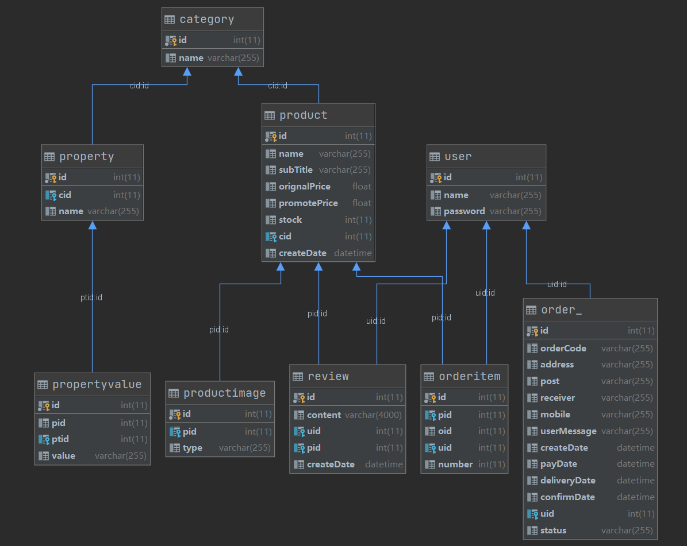

# 项目介绍

使用J2EE技术实现的模仿天猫整站项目,恶趣味的把天猫的图片和信息换成了京东的

学习自[how2j](https://how2j.cn/k/tmall-j2ee/tmall-j2ee-894/894.html?p=28546)

本项目没有使用SSH,SSM框架，而是使用J2EE整套技术来作为解决方案，实现各种业务场景

这样可以比较好的夯实J2EE基础

# 涉及技术点

## 相关思想&技术

数据就是`模型` (bean,DAO)
页面就是`视图` (JSP)
控制不同的模型显示在不同的视图上，这件事就是由`控制器`来完成的 (servlet)

其他更详细的部分可以看doc.md

## 表结构

| Category      |      |      |
| ------------- | ---- | ---- |
| Property      |      |      |
| Product       |      |      |
| PropertyValue |      |      |
| ProductImage  |      |      |
| Review        |      |      |
| User          |      |      |
| Order         |      |      |
| OrderItem     |      |      |

# 如何使用

# License

[Apache License 2.0](LICENSE)

Copyright (c) 2019-2022 stanedward1